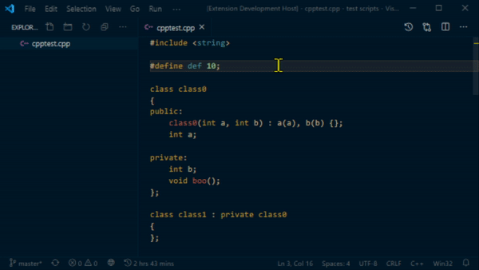

# Wooden Aurora: Theme for VS Code
## A minimal theme with a deep blue background and wood shaded text. It aims for a simplistic look, that's easy to the eyes.

## Preview

## Additional Recommended Settings For a Minimal Look
    "editor.cursorStyle": "block",
    "editor.lineDecorationsWidth": 0,
    "editor.scrollbar.verticalScrollbarSize": 10,
    "editor.folding": false,
    "editor.lineNumbers": "off",
    "editor.minimap.enabled": false,
    "editor.overviewRulerBorder": false,
    "editor.renderIndentGuides": false,
    "editor.renderWhitespace": "none",
    "editor.smoothScrolling": true,
    "breadcrumbs.enabled": false,
    "workbench.sideBar.location": "left",
    "workbench.activityBar.visible": false,
    "editor.fontSize": 15,
    "window.zoomLevel": -2,

## Report Issues

In case you find irregular coloring report it to the following link:

[Issues · heyyod/dark-blue-and-warm (github.com)](https://github.com/heyyod/dark-blue-and-warm/issues)

It would be best to add a screenshot of the code's textmate scope. You can do this by:

1. Press F1 or Ctrl + Shift + P
2. Search for "token"
3. Click "Developer: Inspect Editor Tokens and Scopes"
4. Select the field where the color is not right and take a screenshot of the pop-up box allong with the code.
